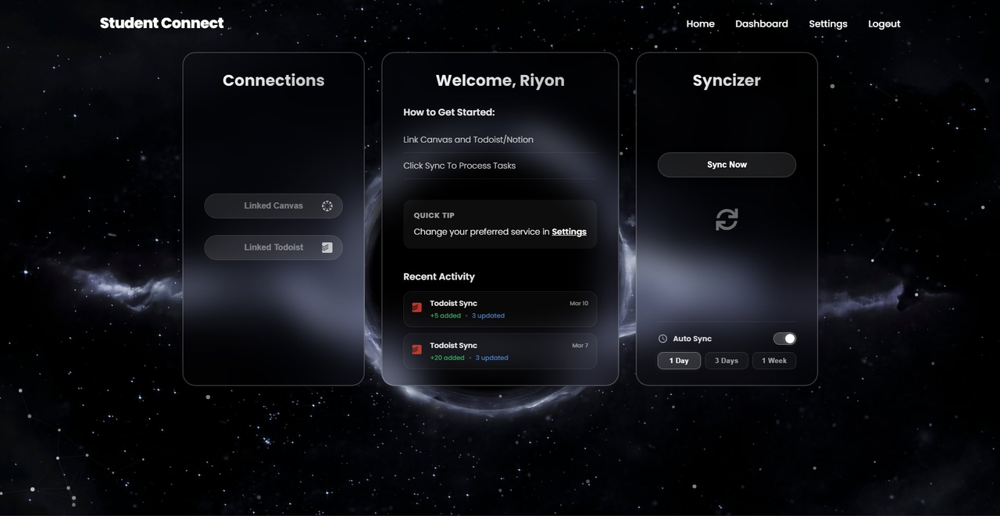
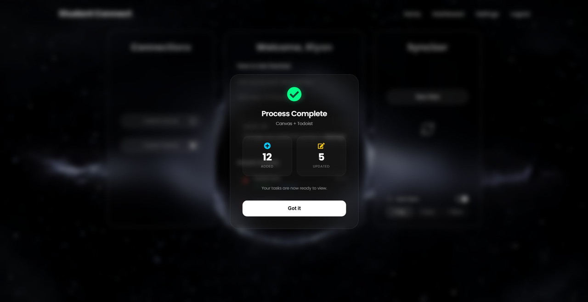
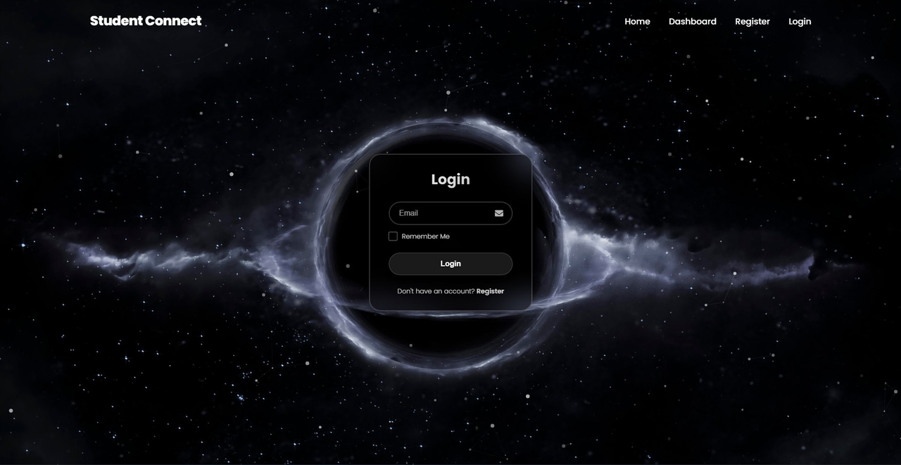
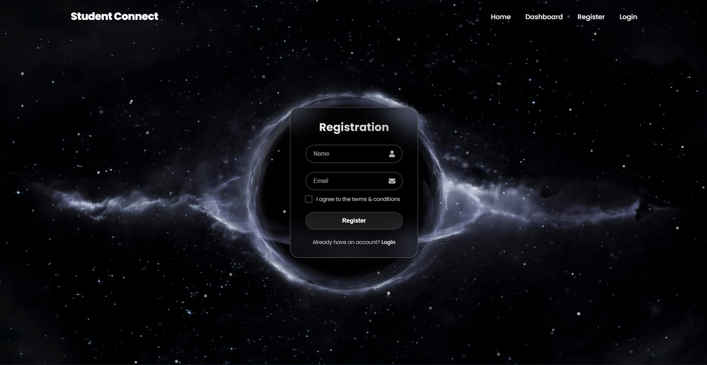

<div align="center">


[](https://reactjs.org/)
[](https://python.org/)
[](https://flask.palletsprojects.com/)
[](https://mongodb.com/)
[](https://vitejs.dev/)
[](https://jwt.io/)

[Overview](#-overview) · [Screenshots](#-screenshots) · [Features](#-features) · [Architecture](#-architecture) · [Security](#-security) · [Getting Started](#-getting-started) · [API Reference](#-api-reference)

</div>

---

## 📌 Overview

Student Connect is a full-stack automation bridge that eliminates the fragmented academic workflow problem. It synchronizes assignment data from **Canvas LMS** directly into **Todoist** or **Notion** — automatically, accurately, and securely.

The core engineering challenge: Canvas, Todoist, and Notion each use entirely different API schemas, date formats, and polling models. Student Connect solves this with a custom **fuzzy datetime normalization engine** and **APScheduler-backed background sync**, achieving near-perfect synchronization accuracy.

> Built as a personal productivity tool — turned into a full production-grade application.

---

## 📸 Screenshots

### Landing Page
> Animated particle background with glassmorphism cards — live orbital ring effect and full page scroll


### Dashboard
> Three-panel layout — live service connections, sync history, and auto-sync scheduler all in one view



### Sync Complete
> Real-time result dialog after a Canvas → Todoist sync — 12 assignments added, 5 due dates updated



### Login
> Passwordless authentication — users verify via email code, no password ever stored



### Register
> New user registration — name and email are RSA-encrypted in the browser before the request is sent



---

## ✨ Features

| Feature | Description |
|---|---|
| 🔄 **Dual-Platform Sync** | Sync Canvas assignments to either Todoist or Notion with one click |
| ⏰ **Auto-Sync Scheduler** | Set recurring syncs every 1 day, 3 days, or 1 week — runs in the background |
| 🧠 **Smart Deduplication** | Fuzzy datetime normalization prevents duplicate tasks across platforms |
| 📧 **Email Notifications** | Get a full sync summary delivered to your email after every sync |
| 🔐 **Zero-Trust Security** | API tokens are encrypted client-side before they ever leave your browser |
| ⏱️ **Sync Cooldown** | Rate-limited sync with a live countdown to prevent API abuse |
| 📊 **Sync History** | Dashboard view of all past syncs with added/updated counts |
| 🔑 **Passwordless Auth** | Email verification code login — no password to store or steal |
| 🌍 **Timezone Aware** | All due dates correctly converted to the user's local timezone |

---

## 🏗️ Architecture

```
┌─────────────────────────────────────────────────────────────┐
│                        React Frontend                       │
│   ┌─────────┐  ┌───────────┐  ┌───────────┐  ┌─────────┐  │
│   │  Login  │  │ Dashboard │  │ Settings  │  │ Register│  │
│   └────┬────┘  └─────┬─────┘  └─────┬─────┘  └────┬────┘  │
│        │             │              │              │        │
│   ┌────▼─────────────▼──────────────▼──────────────▼────┐  │
│   │         node-forge RSA Encryption Layer              │  │
│   │    (All sensitive data encrypted before transit)     │  │
│   └────────────────────────┬─────────────────────────────┘  │
└────────────────────────────│────────────────────────────────┘
                             │ HTTPS + JWT Cookie Auth
┌────────────────────────────▼────────────────────────────────┐
│                      Flask REST API                         │
│  ┌──────────────┐  ┌────────────────┐  ┌────────────────┐   │
│  │  Auth Routes │  │  Sync Routes   │  │Schedule Routes │   │
│  └──────┬───────┘  └───────┬────────┘  └───────┬────────┘   │
│         │                  │                   │            │
│  ┌──────▼───────┐  ┌───────▼──────────────────▼────────┐    │
│  │  RSA Decrypt │  │         Sync Engine               │    │
│  │  + JWT Mgmt  │  │  (fuzzy datetime normalization)   │    │
│  └──────┬───────┘  └───────┬──────────────────┬────────┘    │
│         │                  │                  │             │
└─────────│──────────────────│──────────────────│─────────────┘
          │                  │                  │
   ┌──────▼──────┐   ┌───────▼──────┐   ┌──────▼───────┐
   │   MongoDB   │   │  Canvas LMS  │   │Todoist/Notion│
   │   Atlas     │   │     API      │   │    APIs      │
   └─────────────┘   └──────────────┘   └──────────────┘
          │
   ┌──────▼──────┐
   │ APScheduler │
   │(MongoDB job │
   │   store)    │
   └─────────────┘
```

### Key Engineering Decisions

**Fuzzy Datetime Normalization**
Canvas stores dates as ISO 8601 UTC strings (`2025-04-10T23:59:00Z`). Todoist uses date-only strings in user-local time. Notion uses ISO with timezone offset. The sync engine normalizes all three formats into a canonical UTC representation before comparison, handling edge cases like missing `T` separators, `Z` vs `+00:00` suffixes, and `.000` milliseconds in Notion responses.

**APScheduler + MongoDB Job Store**
Background sync jobs are stored in MongoDB via APScheduler's `MongoDBJobStore`, meaning scheduled jobs **survive server restarts**. On boot, the server calls `_restore_schedules()` to reconcile job store state with user preferences in the database.

**State-Comparison Algorithm**
Rather than blindly overwriting, the sync engine diffs the Canvas assignment list against the existing Todoist/Notion state. New tasks are added. Tasks where the due date has changed are archived/deleted and re-created with the updated date. Unchanged tasks are left untouched — zero unnecessary API calls.

For a full technical breakdown, see [ARCHITECTURE.md](ARCHITECTURE.md).

---

## 🔒 Security

Security was a first-class design concern throughout this project.

### Zero-Trust Encryption Envelope

```
Client (Browser)                          Server
─────────────────                         ──────────────────────────────────
1. Fetch RSA public key      ──────────►  Serve public_key.pem
2. Encrypt API token
   with RSA-OAEP + SHA-256   ──────────►  Receive ciphertext hex string
3. Send encrypted payload                 3. Decrypt with private_key.pem
                                             (password-protected, PKCS8)
                                          4. Re-encrypt with same public key
                                          5. Store ciphertext in MongoDB
                                             (plaintext never persists)
```

- **2048-bit RSA asymmetric encryption** — every sensitive field (Canvas token, Todoist token, Notion token, user name, email) is encrypted in the browser using `node-forge` before being sent over the network
- **Encrypted at rest** — tokens are stored in MongoDB already encrypted; decryption only occurs at sync time, in memory
- **Stateless JWT sessions** via HTTP-only cookies with CSRF double-submit protection
- **Refresh token rotation** — short-lived access tokens (1 hour) with optional 3-day refresh tokens scoped to `/api/refresh` only
- **Passwordless authentication** — users authenticate via time-limited email verification codes; no passwords stored anywhere
- **OAuth 2.0** for Todoist and Notion integrations — state parameter CSRF validation on all OAuth callbacks
- **Rate limiting** on sync endpoint with cooldown enforcement

---

## 🛠️ Tech Stack

### Frontend
| Technology | Purpose |
|---|---|
| React 18 | UI framework |
| Vite | Build tool & dev server |
| React Router v6 | Client-side routing |
| Axios | HTTP client with JWT interceptor |
| node-forge | Client-side RSA encryption |
| react-icons | Icon library |

### Backend
| Technology | Purpose |
|---|---|
| Flask 3.1 | REST API framework |
| Flask-JWT-Extended | JWT auth with cookie support |
| PyMongo | MongoDB driver |
| cryptography | RSA key gen & decryption |
| APScheduler 3.10 | Background job scheduling |
| canvasapi | Canvas LMS Python wrapper |
| todoist-api-python | Todoist REST API client |
| requests | Notion API (REST) |
| yagmail | Email notifications |
| bcrypt | Code hashing |
| pytz | Timezone handling |

### Infrastructure
| Technology | Purpose |
|---|---|
| MongoDB Atlas | Cloud database + APScheduler job store |
| mkcert | Local HTTPS development certificates |

---

## 🚀 Getting Started

### Prerequisites

- Python 3.11+
- Node.js 18+
- MongoDB Atlas account (free tier works)
- [mkcert](https://github.com/FiloSottile/mkcert) for local HTTPS

### 1. Clone the Repository

```bash
git clone https://github.com/riyonp23/Student_Connect.git
cd Student_Connect
```

### 2. Backend Setup

```bash
cd backend

# Create and activate virtual environment
python -m venv venv
source venv/bin/activate        # Windows: venv\Scripts\activate

# Install dependencies
pip install -r requirements.txt

# Set up environment variables
cp .env.example .env
# Fill in your values in .env (see Environment Variables section below)

# Generate local HTTPS certificates
mkcert localhost 127.0.0.1
# Move the generated .pem files into backend/src/

# Start the Flask server
python app.py
```

The backend will run on `https://localhost:5000`.

### 3. Frontend Setup

```bash
cd frontend

# Install dependencies
npm install

# Generate frontend HTTPS certificates
mkcert localhost 127.0.0.1
# Move the generated .pem files into frontend/src/Certs/

# Start the dev server
npm run dev
```

The frontend will run on `https://localhost:5173`.

### Environment Variables

Create a `.env` file in the `backend/` directory using `.env.example` as a template:

```env
# MongoDB
MONGO_URI=mongodb+srv://<user>:<password>@<cluster>.mongodb.net/

# Email service (for sync notifications)
EMAIL=your_email@gmail.com
EMAIL_PASS=your_gmail_app_password

# Todoist OAuth
TODOIST_CLIENT_ID=your_todoist_client_id
TODOIST_CLIENT_SECRET=your_todoist_client_secret

# Notion OAuth
NOTION_CLIENT_ID=your_notion_client_id
NOTION_CLIENT_SECRET=your_notion_client_secret

# Auto-generated on first run (do not set manually)
# JWT_SECRET_KEY=
# PRIVATE_PASS=
```

> **Note:** `JWT_SECRET_KEY` and `PRIVATE_PASS` are auto-generated on first run and appended to `.env` automatically. RSA key pairs are also generated on first run if `private_key.pem` does not exist.

---

## 📁 Project Structure

```
Student_Connect/
├── backend/
│   ├── app.py                  # Flask app, all routes, JWT config
│   ├── requirements.txt
│   ├── .env.example            # Template — never commit .env
│   └── src/
│       ├── sync.py             # Core sync engine (Canvas → Todoist/Notion)
│       ├── utils.py            # RSA encrypt/decrypt, auth helpers, DB ops
│       ├── utils_sync.py       # Fuzzy datetime normalization, state comparison
│       ├── scheduler.py        # APScheduler setup & job management
│       ├── database.py         # MongoDB connection
│       ├── email_service.py    # Sync notification emails
│       ├── logger.py           # Centralized logging
│       └── cleanup_todoist.py  # Utility: remove stale Todoist tasks
│
├── frontend/
│   ├── index.html
│   ├── vite.config.js
│   ├── package.json
│   └── src/
│       ├── App.jsx             # Root component, routing
│       ├── api/
│       │   └── axiosInterceptor.js  # JWT refresh interceptor
│       └── Components/
│           ├── Pages/
│           │   ├── Dashboard/  # Main sync dashboard + history
│           │   ├── Login/      # Passwordless email auth
│           │   ├── Register/   # New user registration
│           │   ├── Settings/   # API token management
│           │   ├── Start/      # Landing page
│           │   ├── Navbar/     # Navigation
│           │   └── Utils/      # Dialogs, popups, shared utilities
│           └── Shared/
│               └── ParticleBackground.jsx
│
├── docs/
│   └── screenshots/            # App screenshots
├── ARCHITECTURE.md             # Extended technical deep dive
├── .gitignore
├── LICENSE
└── README.md
```

---

## 📡 API Reference

| Method | Endpoint | Auth | Description |
|---|---|---|---|
| `GET` | `/api/public-key` | None | Fetch RSA public key for client-side encryption |
| `POST` | `/api/register` | None | Register new user (encrypted payload) |
| `POST` | `/api/code` | None | Request login verification code via email |
| `POST` | `/api/login` | None | Validate code, issue JWT access + refresh tokens |
| `POST` | `/api/refresh` | Refresh JWT | Rotate access token |
| `GET` | `/api/logout` | JWT | Revoke session cookies |
| `GET` | `/api/token-protected` | JWT | Get user dashboard state (linked services) |
| `POST` | `/api/canvas-api-link` | JWT | Validate & store Canvas token (encrypted) |
| `GET` | `/api/todist-api-link` | OAuth | Todoist OAuth callback handler |
| `GET` | `/api/notion-api-link` | OAuth | Notion OAuth callback handler |
| `GET` | `/api/sync` | JWT | Trigger manual sync (rate-limited) |
| `GET` | `/api/sync-history` | JWT | Retrieve past sync logs |
| `POST` | `/api/schedule` | JWT | Enable/disable auto-sync with interval |
| `GET` | `/api/schedule` | JWT | Get current auto-sync preferences |
| `POST` | `/api/settings` | JWT | Switch between Todoist and Notion |
| `POST` | `/api/unlink` | JWT | Unlink a service (Canvas/Todoist/Notion) |

---

## 🗺️ Roadmap

- [ ] Deploy to cloud (Railway + Vercel)
- [ ] Add demo video walkthrough
- [ ] Canvas course filter (select which courses to sync)
- [ ] Mobile-responsive UI improvements
- [ ] Support for Google Tasks as a third sync target

---

## 👤 Author

**Riyon Praveen** — Computer Science Student, Class of 2027

[](https://linkedin.com/in/riyonpraveen)
[](https://github.com/riyonp23)

---

## 📄 License

This project is licensed under the MIT License — see [LICENSE](LICENSE) for details.

---

<div align="center">
  <sub>Built with ☕ and a genuine frustration with manually copying Canvas assignments into Todoist.</sub>
</div>
